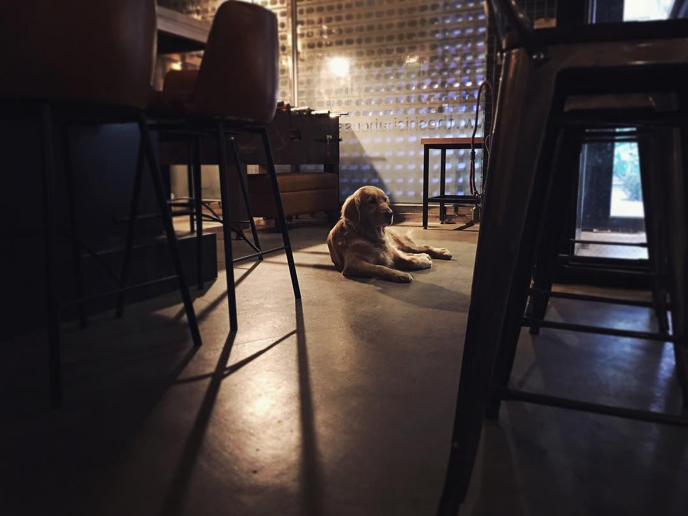
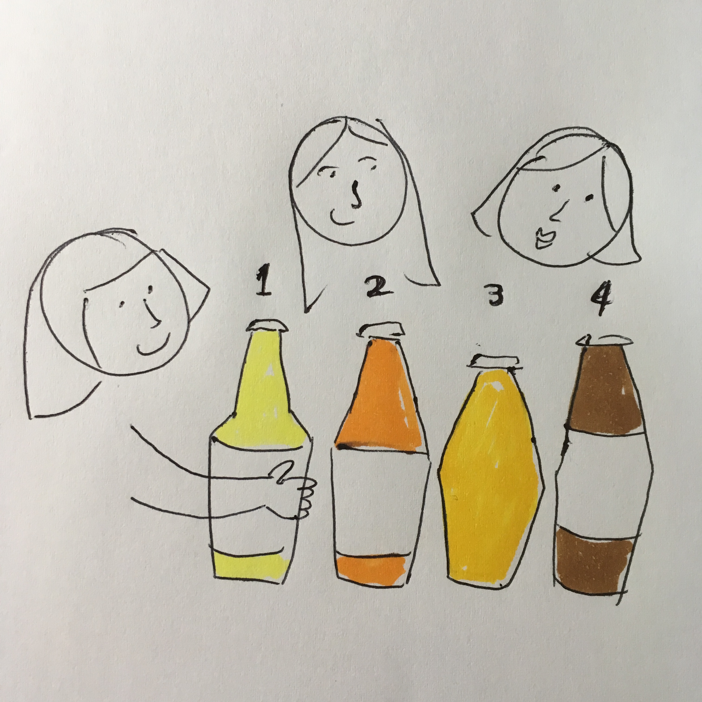
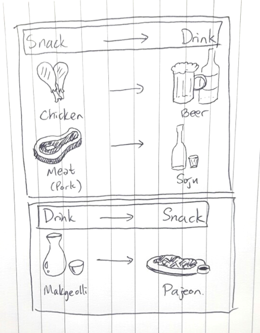
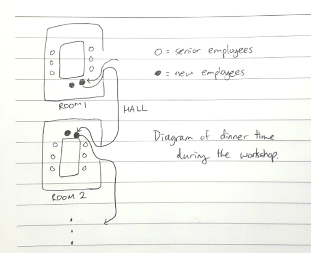
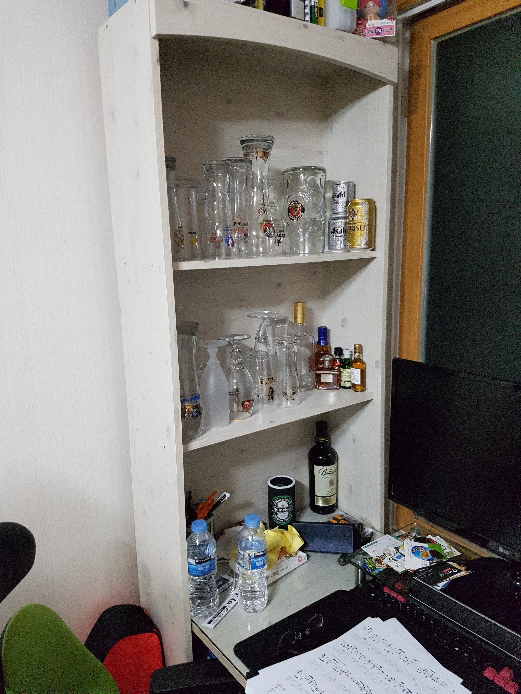

Design Project 1: Needfinding
===================
----------
Team Name: **Drunken GUI**  
Team Members: **Sangyeob Lee, Sunmin Son, Hyungwoo Kim, Kyungyun Lee**

----------

### **Experience:**
We are planning to redesign the experience of drinking

-----------
### **Observations & Interviews:**

### Interview 1 
 > 
 > 
 >
 > - Age/Sex : 38, Female
 > - Occupation : Pub owner
 > - Interviewer : Kyung Yun Lee, Hyungwoo Kim

> Jiyeon and her husband owns a well-known pub that specializes in beer. Their most popular items are craft beers that they make. The pub attracts all types of people, ranging from university students, who want to find a good quality beer to foreigners in the area. Many people actually are long time regular customers, who seek for unique and high quality drinks. When interviewing Jiyeon, she was quite humble, despite the fact that she owns a bar and probably has way more knowledge about drinks than average drinkers. Unlike other interviewees, there were some interesting comments that were due to her deeper understanding of drinks. She has a specific preference in the types of beers: sour ale, IPA and not too cold beer. When going out for a drink, she will definitely explore new beers, but she knows what she is ordering. Therefore, if she is with her friends, they will order different drinks, and actually line them up to create a order in which one to drink first. Although it felt like she knew a lot about beers, both her and her husband mentioned that they will never know a lot about beers, because there are way too many variety of beers and that crafting beer is a very delicate and sensitive process. They say even getting the right flatness of a beer is a very difficult process and that most people cannot distinguish a flat beer from a non-flat one. Additionally, Jiyeon mentioned that she rarely gets sweet drinks and that the reason is calories. As she got older, she does not drink more than 2 drinks a night, and because she is now more aware of the hangovers, she refrains from overdrinking. She drinks 3~4 times a week, and drinking is normally not planned, because the most frequent motivation to drink is self reward and then, the special occasions, like seeing friends in a long time, follow. When asked about exploring different bars and the important factors that are considered when choosing a place to drink, she said she does not normally have time to do such things, since she runs her bar at night. But she always keeps an eye on places she want to go, when she have a free night. 

### Interview 2
> 
>
> - Age/Sex : 26, Male
> - Occupation: Researcher
> - Interviewer : Sunmin Son

>The researcher’s most recent major drinking occasion was held three months ago, with the members of his department. It was a long time ago because he stopped working there since January. The pub that they went to sold beer at a cheap price and seemed to make most of the profit from the snacks (such as rolled omelets and fried foods). He said that the oldest senior researcher usually led the group on those kinds of drinking occasions. When asked what it feels like to be the only person who does not drink, he said that his philosophy is to try to merge into the group by not being affected by that fact and enjoying the time together. He mainly participates on those occasions in order to not feel excluded from his co-workers and to avoid creating any misunderstandings. He wanted to convey the message that he still wanted to hang out with them, even though he did not want to drink any alcohol. However, on the other hand, he found out that he needed to make a firm stand in his non-drinking lifestyle as he was constantly pressured to drink. An interesting point that he found out while participating on the drinking occasions was that the food usually decided the drink. For example, they drank soju when they were having dinner while they drank beer when they wanted to eat cheese-related foods or egg omelets. But after talking about it, we soon found out that it could easily be the other way around as well (see sketch)!

### Interview 3
>
>
> - Age/Sex : 27, Female
> - Occupation: Office Worker
> - Interviewer : Hyungwoo Kim, Sunmin Son

>The female office worker recalled the overnight workshop that she participated in last weekend. She described in detail what it was like (see sketch). The workshop dinner was held at a Korean traditional restaurant, where groups of employees were seated in different rooms. Since she was the newest employee and also the youngest in her office, she and a few others were called to go to each room and greet the senior employees, introducing themselves. While everyone drank special alcohol from the local area, she kept herself busy munching on the snacks. Her role later that night was to listen to the talks that her senior employees gave, to take care of the severely drunk, and to collect any leftover possessions. She naturally did this because she did not have to worry about getting drunk. She did not feel awkward in the situation because she used to drink a lot when she was a college student. It was interesting to see someone who does not drink alcohol anymore but knows so much about it at the same time. She seemed to have no trouble fitting in because her philosophy on participating on those drinking occasions was “party like you’re drunk”.

### Interview 4
 > 
 >
 > - Age/Sex : 23, Male
 > - Occupation : Graduate Student
 > - Interviewer : Sangyeob Lee
 
 >Hyungmuk is a graduate student who drinks very frequently. He collects beer mugs and when he drinks, he uses corresponding mug for the beer. He drinks 4-5 times a week and 2-3 cans of beer at a time. However, most of the time he drinks alone at home. When he selects a pub, he values the taste of beer over the other factors, but the price is also important. He prefers non-sweet fizzy beer, and soup for the snack. Hyungmuk thinks he knows more about beers than the other people, but he wanted to explore more kind of beer. He does not have particular philosophy on drinking. But when he recruits drinkers, he tends to call people who like drinking, because they are relatively easier to call. When there are uncomfortable person in the group, he acts as if he likes the person and drink a lot. After a while, the boundary of like/dislike disappears by the power of alcohol. 

-----------
### **Needs:**
- There are too many types of beer that even experts are unable to keep up with everything
- People want to get information about where to get variety of drinks at a cheaper price (세계맥주 4+1 행사, 고급 와인 창고 세일) especially because more people are drinking alone at home.
- People want to know what a certain drink tastes like before they buy it.
- People sometimes have trouble finding people to drink with.
- People want to know what happened the night before (흑역사).
- collecting money from the people after drinking.
- People want to know how much alcohol they drank (주량).
- People want to check if there is enough space (or preferred spot) for the group.
- People want to prove that they are not drunk.
- Transparent ordering history.

-----------
### **Insights**
- People who know about drinks well, have their own “methods” for drinking.
- Everyone has his or her preference when it comes to beer!
- Age hits you hard.
- People avoid sweeter alcohols because they are worried about high calories.
- Conform to majority when ordering drinks/snacks.
- Even people who know a lot about liquor know what they are ordering before actually ordering.
- People who don’t drink feel left out when they don’t know how to make a certain combination of mixture.
- Not everyone prefers cold beer.
- People drink to give themselves a reward.
- People who like to drink alone drink spontaneously more often 
- People usually play drinking games when the number of people makes it difficult for everybody at the table to participate on the same conversation

-----------

### **Studio Reflections:** 

 **Feedback Summary**: 
 
People liked our idea of redesigning the experience connected to drinking. It's very relevant to Korean culture; therefore, producing a solution seems useful. However, there seems to be a lack of focus in trying to find the problem with drinking Graphic User Interface. Also redesigning means that there is a previous design that needs to be worked on, so our group should have an inconvenient UI that needs to be improved upon. But our group doesn't have that yet. In other words, we need to pinpoint the problem.

**Course of Action**: 

In "Needfinding" part of the design project, we focused mainly on observing and empathizing with the potential target users in the domain of (alcohol) drinking activity. We honestly thought that needfinding step was just purely taking an experience and trying to find an interesting points and the possible needs that people want in their particular activity. Through series of interviews, our group has gathered existing needs from the non drinkers to drinkers. In the upcoming weeks, we will define the problem by eliminating need that cannot be satisfied with web application. We will try to find application with user interface that's used for activities relevant to drinking. If not, we will try to make a creative solution to redesign the experience of drinkers so that they have their needs fulfilled. In order to do so, we will investigate possible ways to improve the experience before the next studio session.
