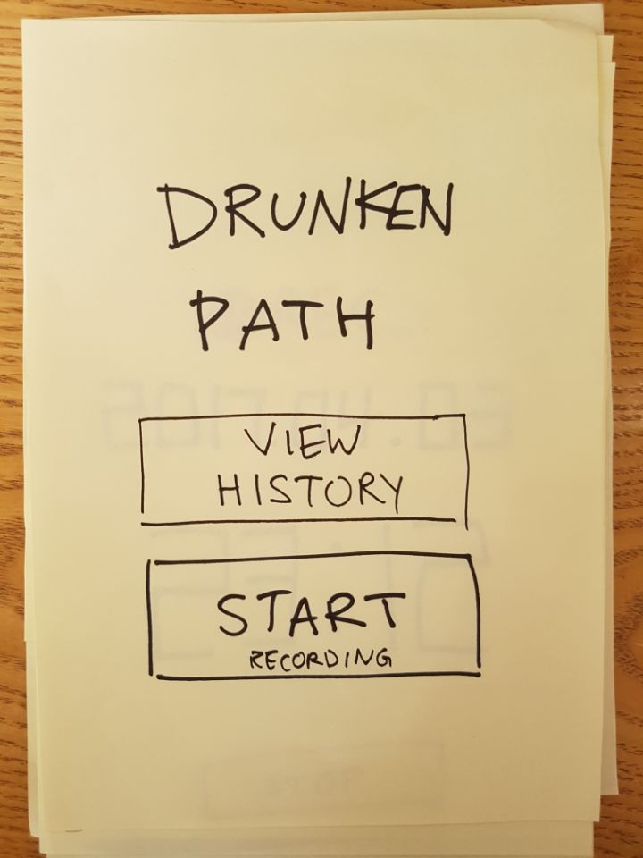
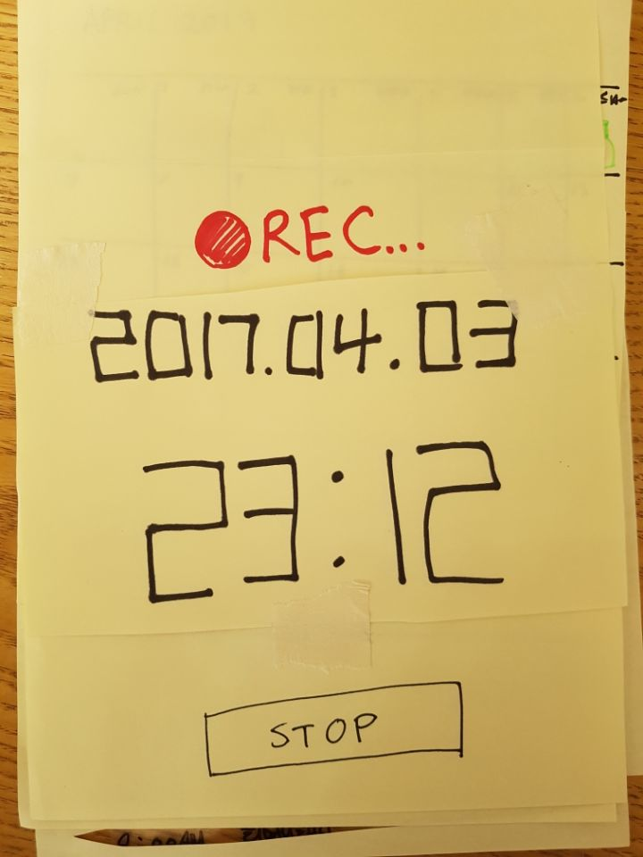
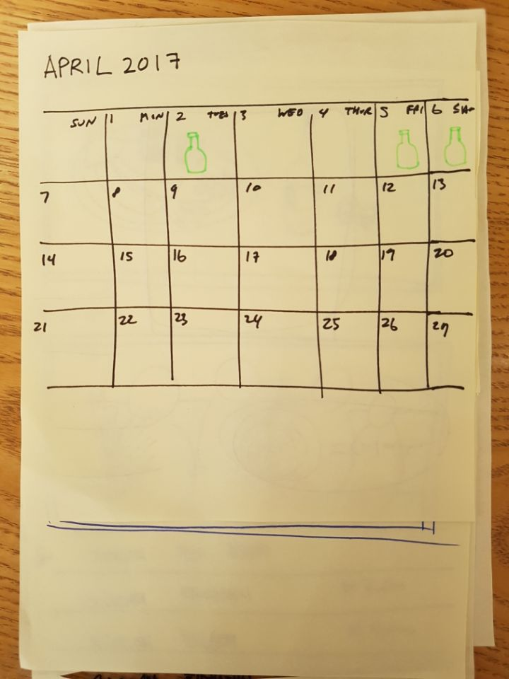
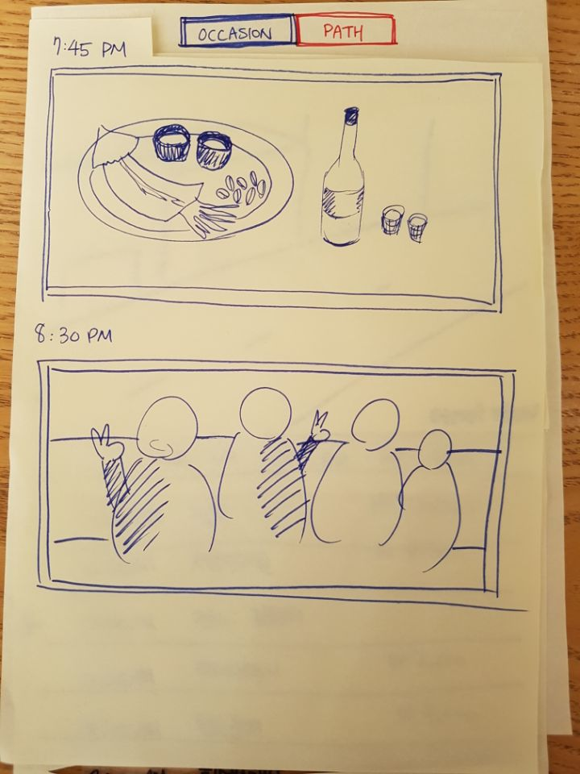
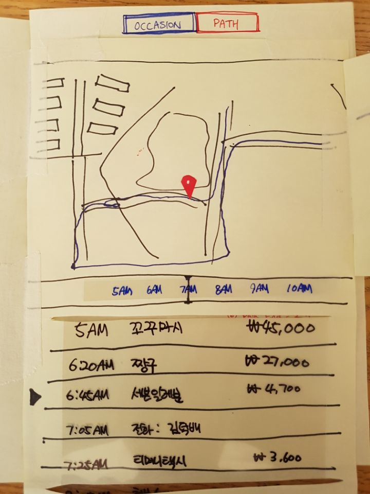
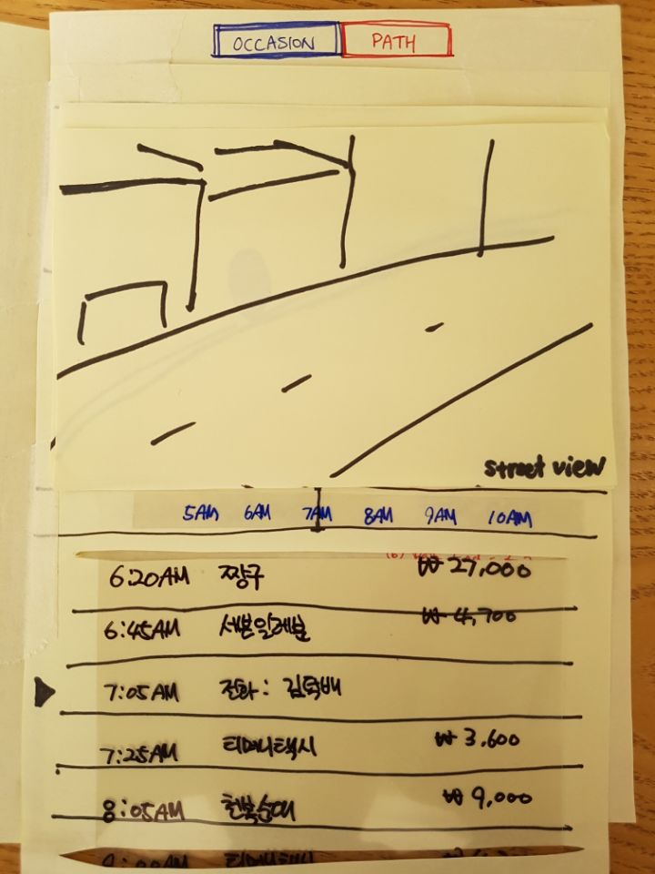

Design Project 3: Paper Prototyping
===================
----------
Team Name: **Drunken GUI**  
Team Members: **Sangyeob Lee, Sunmin Son, Hyungwoo Kim, Kyungyun Lee**

----------

### **Photos of your prototype:**

> Main menu

> Recording screen. Users can reach here by click/tapping on the start recording button on the main menu.

> When clicking/tapping view history button on the main menu, this calendar will show up. The soju bottles represent days you recorded.

> After selecting a date in the calendar, photos of the day will be displayed

> And by tapping on the path tab on the top, the user can see where he/she was and what he/she did on the day. The list of activity, time, and marker on the map are scrollable and once the user moves one of it, the others will move along.

> When zooming the map, the user will be able to see the map in street view

-----------
### **Participants:**

-----------
### **Briefing:**

>Hello, we are team DrunkenGUI from Human-Computer Interaction class. We wanted to redesign the drinking experience for people who frequently go out to drink. After interviewing some people, we found that many drinkers are curious about what happened night before because it’s difficult to remember things when you were drunk. So we wanted to provide a service to resolve this problem.

>In our application, we make it easy for the user to start recording their night and to check out what they did when they wake up the next morning (hopefully). Since people are interested in where they were and what they did or said the night before, we provided a user interface and functions to do just that in our application.

*summary: we showed the participants the same two paragraphs we wrote above. It explains what we are trying to do and briefly hint what user can expect from our prototype*

-----------
### **Tasks**

-----------
### **Observations**

-----------
### **Individual Reflections**

HyungWoo Kim: In each round of the paper prototype testing, I was the computer guy; I would do the task the application would have done if it was actual product when used by the target users. While carrying out my role, the hardest part was trying to hold back from telling the user that he or she should do certain task or that he or she can't do such task on this application. Through our paper prototyping, we were able to find both the major and subtle faults in our application, such as not being clear on what the user can do at certain pages(calendar page) of the application. In addition I was happy to find out that a lot of users would use our application if it was an actual product. In paper prototyping, we were able to find out if the tasks are able to be done by the users. However, we weren't able to find out if these tasks were actually implementable as well as how it would do in real context without having the facilitator involved in the testing session.

Sangyeob Lee: I was the observer through out the user test. I found out that users were not comfortable doing thinking aloud. They sometimes stopped and thinking for a while before they do something. I guess our prototype were not intuitive enough. After selecting a day in the calendar, they took a long time to figure out what to do in order to see the route. The tabs(occasion/path) on the top should be larger and noticeable. Also the quality of the prototype was crude and users knew about that. So sometimes it was not clear that some UI objects are able to interact with or not.

KyungYun Lee: During prototype testing, I was the observer. As I was not able to engage, it helped to see the whole process of the user interacting with our prototype in a neutral manner. Also, I was able to discover the problem with the overall flow of the system. For example, we thought at first that we need to show the user all the past archives of the drinking nights on a calendar, and the user can select the date to view the history. However, during the prototype testing, I felt that there was an extra step for the user to take when the user is actually probably only interested in the last night's or the most recent night's history. So, maybe the solution is to make the recent history page as a default and allow the user to view the archive only when they wish to. Also, the service is not something that users will spend a lot of time on it. The main reason is they want to know what happened last drinking night. So, we should minimize the functions and focus on our main purpose, instead of adding extraneous features. Often more features lead to user getting lost and overwhelmed. Also, we should note that users may not be in the best condition when he or she is checking the app (might be hungover!), so the interface should not be annoying. 

-----------

### **Studio Reflections:** 

**Feedback Summary && Course of Action**: 

