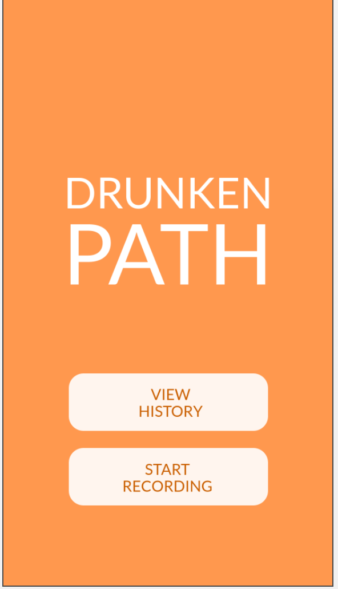
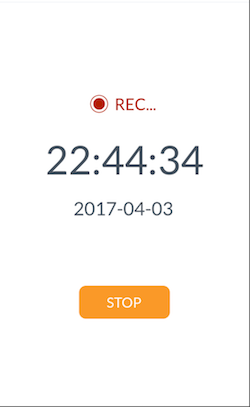
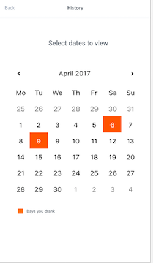
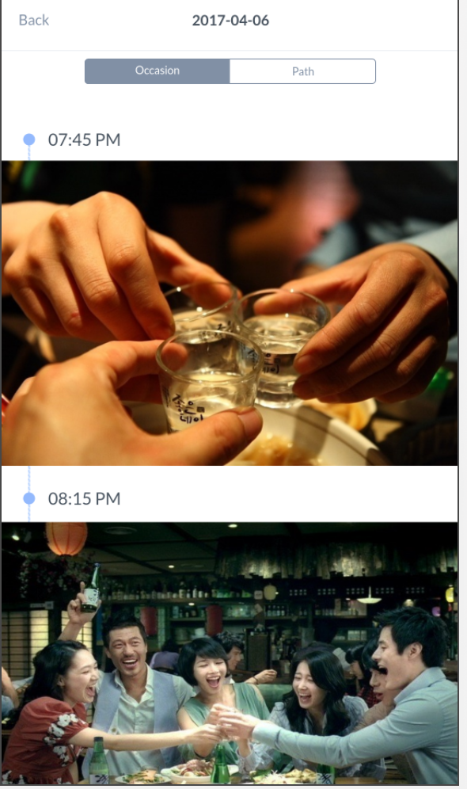
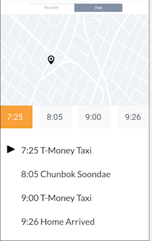

Design Project 4: Lo-fi Prototyping
===================
----------
Team Name: **Drunken GUI**  
Team Members: **Sangyeob Lee, Sunmin Son, Hyungwoo Kim, Kyungyun Lee**

----------

### **POV:**
* **USER** - someone who frequently goes out to drink
* **USER’S NEED** - tools to help him remember what happened during past drinking occasions
* **INSIGHT** - it is frustrating for the user who often fails to recall his memories after drinking too much

-----------
### **Tasks:**

* Start recording
* Recall what you did last night (during the drinking occasion)
* Find out where you were last night (according to location)

-----------
### **Prototype:**

* **Prototyping tool**: We used marvelapp.com for our digital prototyping because the other two did not have what we wanted such as sharing or directly making a UI with the prototyping program's User Interface. For example, proto.io did not have sharing ability so it was difficult to "share" and co-work. Invision did have sharing but it did not have user interface tool to directly create UI; the program required the user to draw and upload. 

*  **Design Choices** : We chose not to implement smooth transition in time because that would take a lot of time. We first wanted to check through this Lo-fi prototype if our idea of history timeline made sense to the user. Additional feature of seeing the cost and zooming in on the map were not implemented. Cost display and zooming were not implemented because we wanted to see what was enough information for the users. Lastly, we didn't implement actual timer ticking; however, we did implement the future recording page to see if the user had any difficulty of stopping recording time via our simple user interface.

*  **Representative Screenshots** : 

*  **Instructions** :
  * Our prototype is accessible through following link: https://marvelapp.com/43g90a1/screen/27327836 

  * When first opened press enable location access (it was made to pretend that we are using the location service to track the user).  The rest is self-explanatory. The user can start recording by pressing the record, there's a stop button when the user want to stop the recording. User can see the history (path and pictures) of drinking with view history.

-----------
### **Observations**

* The user always has to select dates from the calendar
  * provide a default page with the most recent history, because most of the time, the user wants to check the most recent history(last night)
  * can show up to 5 most recent histories in one page and users can scroll down like a blog and additionally we can make a button to view all past histories, which can lead us to the calendar page
  
* Need more information/detail about the visited places, money spent, calls made
  * click on the entries and expand to show more details
  
* Starting and ending the recording is not understandable. Users are confused whether the recording automatically stops or not and what would happen when the user forgets to stop recording.
  * hmm 어떻게하지
  * when the user presses stop, it should not lead to the main page, but rather display the accumulated information so far for that night.
  * stop button should change to a resume button, in case the user accidentally clicked stop
  
* Wants the visualization of the exact path 

* Confusion about how the photos will be taken and gets added to the photo section
  * Photo syncing with album?
  * Alarm the user to take photos (every 1 hour? 2 hours? depending on user settings)
 
* Asking for permission for the gps access as the starting page is not necessary. It should be shown when the user starts recording ofr the first time or when the user's setting to the permission is int "not allowed" state.
  
-----------
### **Paper vs Digital**

* Types of usability issues that digital prototypes helped to identify
  * To check smooth and natural transition between tasks
  * To see whether there are awkward motions or actions required
  * 

* participant's reaction and expectation to prototypes
  * participants generally had higher expectation when using digital prototypes, so a little bit less patient
  * 
* changes made from paper to digital prototype
  * confirm from users that gps information will be collected 
  * 

-----------

### **Studio Reflections:**

**Feedback Summary && Course of Action**:

