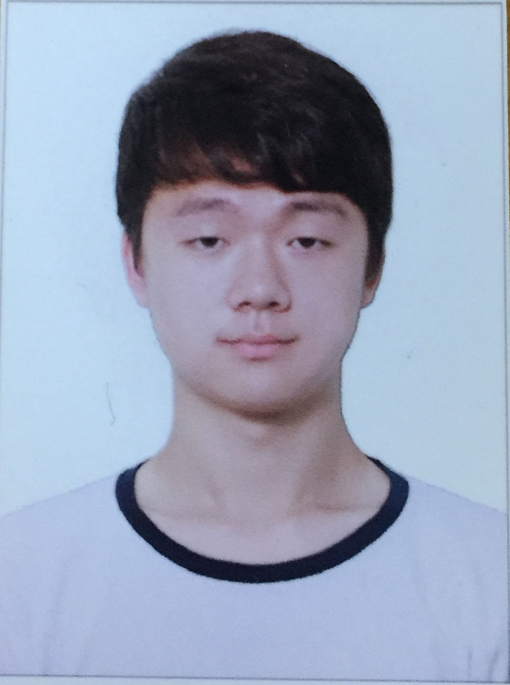

Design Project 7: User Testing
===================
----------
Team Name: **Drunken GUI**  
Team Members: **Sangyeob Lee, Sunmin Son, Hyungwoo Kim, Kyungyun Lee**

----------

### **Written Protocol:**
* Instructions for preparation and setting up the testing environment:
	* Our user study consists of data created by the web application makers. The tested users will participate assuming that they were the ones who started and stopped the already-existing data.
	* Since our objective is if our user interface is intuitive and learnable, we believed that making the tester remember what this other person did last night can still prove the effectiveness of our user interface.
	* The users will be given a link to enter into the main page of our application (https://cdn.rawgit.com/erickim713/DesignProject/fc422796/prototype/index.html)
	* When the user starts using the application, two members of our team will observe and record any comments or details that the user presents. while one person will be ready to assist the user if user gets stuck and is unable move on without help (hopefully this doesn't happen). The last person will be in charge of correcting any technological issues who will come into play if there is an error with the web application during the tests.

* Introduction:
	> Thank you for participating in our user study.
	We found that people who go out to drink often find their wallets empty, glasses broken or missing, call histories that are unexplainable. Our Drunken Path web application aims to help users who often go out to drink recollect their memories about what they did last night. We hope that you are able to have a fun and helpful experience while recalling your memories from your drunk nights through our web application.

* Informed consent:
	> We need your personal information to analyze our project’s results for future improvements. We will collect your photo, age, gender, and occupation data. Do you agree?

* Tutorial:
	* To test our app's intuitiveness, affordance, and learnability we have no tutorial or training.

* Task List & Instructions:
	* Recording
		* Begin the recording (test start recording)
		* End the recording (test end recording)
	* Find out what you did on previous nights
		* How much are you supposed to collect from your friends on May 2nd?
		* How much did you spend the whole day?
	* Find out where you were on previous nights
		* Where were you at 11:50pm on May 5th?
		* At what time did you arrive at your home on April 27th?

* Recording Strategy:
	* We will have screen recording so that we can capture the user behavior during the user testing.
	* Two members will record the user behavior and feedback during the user testing (user’s tend to speak out loud if they are looking for something)
	* One member will standby so that if users have trouble using the application for the sake of other task testing, the standby person will help.
	* Lastly, one member (the tech person) will wait to see if there are any malfunctionings during test.

* Interview Questions:
	* Recording
		* Were there any difficulties in starting and stopping the recording?
	* Finding out the location
		* Were you able to locate where you were at a specific time?
		* Do you think you will be able to guess where you lost any of your belongings through this function?
		* Was there anything that was counter-intuitive in the navigation?
	* Finding out what you did
		* Were you able to find out how much money you spent?
		* Do you think this application will be useful in splitting the money the day after(and perhaps calculating the amount of money you need to collect)?
		* Were you able to find out who you were with last night?
	* Other
		* Is there anything about the overall design that you like?
		* Is there anything that needs improvement?

* Debrief Prompt:
	> Thank you for taking part in our project.

	> We are trying to aid people who often drink a lot and fail to recover their memories from previous nights. We hope you enjoyed our application that tracks the user's location and records the user's activities.

### **Session Observations**

#### User Testing 1 ####

Participant: 24 years old, Male 
Recruit method: Close friend of one of our members 
Why this person?: He doesn't drink too often but when he drinks a lot he tends to lose his stuff and forget where he left his belongings.

Summary 
 The user stated that the app was really useful because he can clearly see where he was last night. Just by doing that, he said, the possible locations of the lost belongings are limited. In addition he said the navigation and usage of the app was very intuitive. He first stated that calendar was not intuitive enough because of the unfinished implementation. He also stated that history page was not intuitve. The information that it provides is really valuable and easy to use when the user is used to it but when encountering first time, he said he didn't know what to do.

#### User Testing 2 ####
**Participant:** 22 years old, Male 
**Recruit method:** Friend from a band club 
**Why this person?:** He was interested in the application because he had many friends who always drink too much and need to be taken care of.

**Summary:** 
  It was a little hard to understand how to use the interface at first. There needs to be an explanation of the first screen by the functions. Also, after stopping the recording, it would be nice to tell the user that a new recording has been successfully made. I thought the application was very useful in the way that it told me how much I used, and showed me who I was with during the occasion. I think the vertical scroll in the path tab of the history page needs to be calibrated properly so that the location is matched with the transaction. I didn't have too much trouble carrying out the tasks. I wish the photos were also ordered or organized in a way that allows me to match the location with the photos. I remember my friend who lost his cellphone at a pub, but still could not find it. However, if he had this applications, that friend might have found it! I think that this can also be useful for any other objects that do not support GPS(such as shoes, keys, wallets, etc). This web application seems to have many functions but it does not seem to be specialized for a specific purpose. 

#### User Testing 3 ####
**Participant:** 20 years old, Female 
**Recruit method:** Random freshman on the street 
**Why this person?:** She showed interest becasue many of her freshmen friends often go out drinking together.

**Summary:** 
  First of all, this user did not want to have her profile exposed for our testing. She said that the front page needed some labeling so that the information showed makes more sense to the user. She recommended studying other applications that had similar functions. She also highly criticized the calendar interface that did not seem to work and display the information as she expected it to. But generally, she thought this application was a great idea and could vision many people using it in the future. Finally, she asked if there could be any korean versions of the web application.

-----------
### **Usability Lessons**

**Missing/ expected/ suggested features that could improve UI
* P1 : There is no instruction or warning on what kind of things will happen when user starts recording (e.g GPS tracking will happen, at what time the recording will end, what the user should do to save photos...etc) (high)
	* Create a pop-up alert message, briefly notifying the user about the consequences
* P2 : There is no delete history button (the user may want to delete unwanted memories) (mid)
	 * Add a “delete” button to the history list. No need of an edit button but delete button is needed.
* P3 : The individual history page doesn't have a filtering option for the list of activities (low)
	* Our idea had a filtering feature but didn’t implement it here
* P4 : The data is only relevant to the user's recording but users are also interested in their friends' record as well. (low)
	* Actually we wanted to add SNS-like features, but it was beyond the scope of this class, so we omitted. However, it definitely is a notable feature.
* P5 : When days not drank are selected on the calendar, there is no feedback that the selected date has no information/record. (low)
	* Can be improved by making the dates unselectable.
* P6 : Some customisable settings would be helpful (mid)
	* Need a settings page where type of recordings can be modified, time when recording automatically ends can be modified as well and  also setting where the user’s home is will also be helpful for GPS tracking.

 **Inconvience and potential error
* P7 : Days drank marked on calendar disappears when clicking on other dates or clicking on previous/next month buttons (low)
	* Minor bug that should be fixed by connecting the calendar to the database
* P8 : How to prevent accidentally pressing stop record, because the user is drunk. (low)
	* Idea : add a “slide to unlock” kind of feature to lock the phone while recording
* P9 : Navigating and exploring the history page with the time slider that synchronises with the map was not familiar for the first time users (low)
	* Users did quickly get used to it. However, there might be too many things ( 3 different UIs) that are changing at the same time.
* P10 : First time users feel like the app is missing some instructional information. (mid)
	* Create a simple info page under the menu bar 

### ** Overall reflection **
Because our service is not a complicated and extensive, we tried to make sure we do not add extraneous features to make the service unnecessarily complicated. We made sure our focus was on checking back on the recorded history, and the user testing was effective in showing that people's main interest is indeed what they did and where they were last night. There were many questions about how the recording actually works. People showed concern about what would happen if they accidently press stop button or they wanted to make sure that they were reminded for taking photo and the photos were automatically saved in the app, instead of them manually saving them into the app. Overall, the feedback was positive about the UI as well as the idea and the uniqueness (+ fun) of the service. For next time, we should not just assume that not implementing certain features can be just replaced by our explanations, but rather we should at least build a strong layout and inform the unimplemented features to the users beforehand so that they focus on the features they are testing on. 

-----------
### **Plan for Iterations**
Mostly we will spend time refining the UI. We will try to implement insights we have gotten from the usability tests done. Although no major problems were identified, minor changes and details can be added for improvement. We will add some warning/notification that alerts the user that tracking of GPS, call history, bank transactions will begin, when starting to record the data. Also, because our service is a mobile web application, it needs to be viewed on a phone. However, we experienced some error with certain browers, so we will figure out how to handle these problems next week.

### **Studio Reflections**

#### Feedback Summary & Course of Action
The main feedback of our studio session was that our questions did not seem to be specifically related to each task. We therefore modified our questions to properly explore the usability problems of our web applications. The questions are now categorized into each of the different tasks, so that users can answer in more detail.

