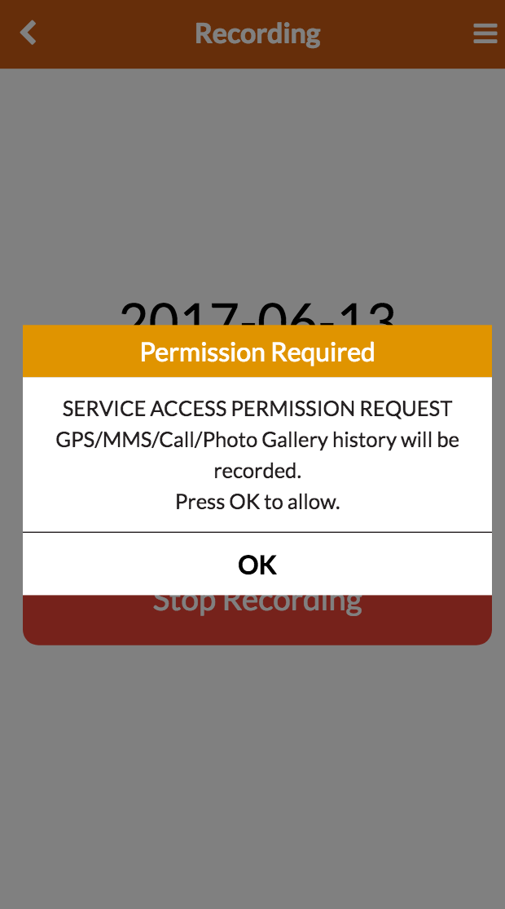
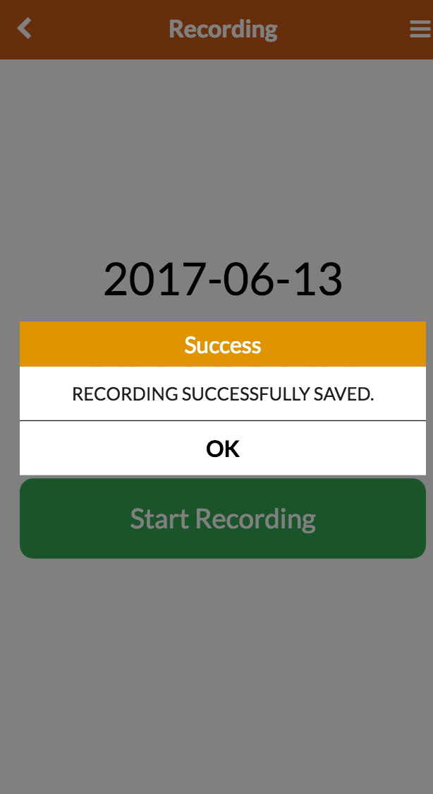
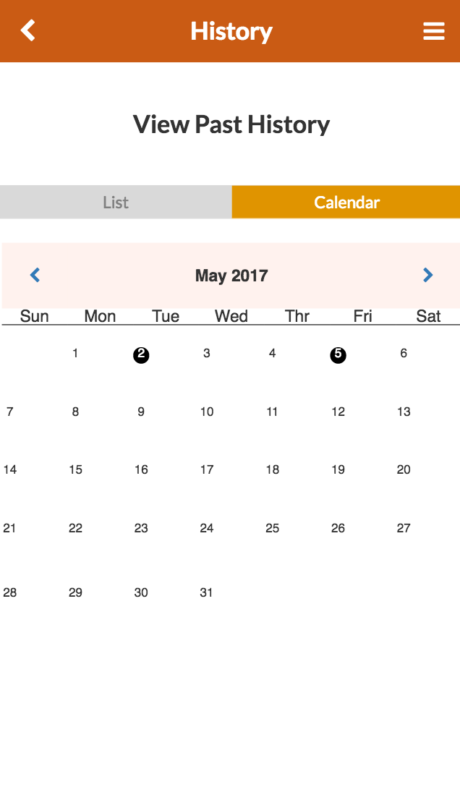

Design Project 8: Iteration & Wrap-up(FINALLY OMFG)
===================
----------
Team Name: **Drunken GUI**  
Team Members: **Sangyeob Lee, Sunmin Son, Hyungwoo Kim, Kyungyun Lee**

----------

### **Iteration:**
* What did we do?
	- Fix problems that arose from the first user testing.
	- Refine the user testing instruction
	- Second round of user testing
* Why?
	- Since our goal is to make the mobile web application most effective by adapting to the user's need and intuition it's necessary for us to fix the problems that were found during the user testing.
	- We also refined the user testing instructions so that it's less confusing for user to understand what they are supposed to do during the user testing
	- We also did second round of user testing to make sure that we improved from the previous version.
* What changes did we make?
	- Pop up to give good feedback to the user, make a "instruction" feature so that users can get a clue of what they can do with the application, calendar fix so that it works, main page changes so that user's not encountered with too much information.
* Concrete examples:
	- feedbacks we added
	- 
	- 
	- calendar fix
	- 
* What did you learn?:
	- We learned from the user testings that effective and user-satisfying applications can be made; however, there's always room for more user testing that can improve the usability (learnability, efficiency, safety) of the application.
	- Also we learned that instruction page is actually really helpful. As a developer we thought that instruction page was an extra feature that would be just taking up spot and reduce the simplicity of the application. However, for users who are wondering what applications can do, it was very valuable.
----------

### **Individual Reflection:**
이것을 답하시면 됍니당.
>What part of the UI implementation did you contribute to?
What worked well and not in your team? How did you overcome any hurdle in teamwork? What lesson about teamwork did you learn that you might apply to your next team project?
Throughout the team-based design project experience, what did you learn about the user-centered design process and web-based GUI implementation?

* Sangyeob Lee

>>

* Sunmin Son

> I was in charge of the recording page and the scrollling (time-based and event-based) interface of the history page. I also worked on the initial implementation of the photos page. I believe that our team was a well-balanced team for a project like this because we had two students who had a industrial design background while the other two had a computer science background. Our group meeetings were short, as we were able to easily agree on who would be in charge of which parts. We divided work fairly without much conflict. Each of us did what we promised to do and were able to contribute to the team according to our talents. One hurdle that we had to overcome was the difference in view between team members when deciding which UI seemed to fit our goals. However, we were able to overcome this hurdle through hard and long discussions, respecting each other's views, and coming to a agreeable settlement. One lesson I learned about teamwork is that group meetings are better if they are short. If they become longer, the group becomes inefficient and cirticisms without good solutions may occur, tiring the entire group. Through this expereince, I found that there are other users who think very differently than myself. I always thought if I made a GUI that I liked, other people will probably like it. However, the user-centered design really taught me that I have to get to know the user, including his background and situation. There was a lot more in the design process than I thought! One thing I learned from web-based GUI implementation was that the more the experience in this area, the better. Sangyeob, our group member had a lot of experiece with HTML, CSS, and Javascript, and was therefore able to help us massively in our implementation.

* HyungWoo Kim

> I was in charge of the display of date in our user interface. At first I only had calendar in my mind but we got feedback from the peer evaluation and other user testing that calendar is useful but people are more willing to go straight to the event they are most interested. This was done through a list format, where the list format had the day's tracking view and the day of the event. However, we still kept the calendar feature by having it as a separate tab. This way the user has both calendar and list to go through. Nothing really did not work bad in our team it's just that each person had strength that other person did not have. We all had merits; some members were really good at actual implementation and some members were really good at design and aesthetic principle. I think our team had a great synergy; we all first did our part and helped each other out on parts that we lacked. From this, I learned that one person cannot do everything perfectly; however, just like a iteration process, if one's work is analyzed under other's eyes, they might find new, brilliant aspect or lacking point that other teammate can help with.
Throughout the design project, we learned that developers have to work closely with the users to make sure that users' needs are addressed in the work. Otherwise, the work would be very pointless because it might just satisfy what we think users need rather than satisfying the actual users' need. Throughout this project, I learned a lot about web-based GUI implementation. I realized that aesthetic looks are not the only thing that matters. I had to make sure colors are comfortable to the users' eyes (avoiding saturated colors, as well as using few colors). As well as make the user interface so that the learnability issues are not confusing the users in doing tasks. Lastly, the iterative steps are very important. One change that was done to address an issue in a user testing might have caused negative effect or undesired effect. In developing Web-based GUI, iterative steps are crucial in order to refine the end product.

* Kyungyun Lee

> I started out with sketching out wireframes for the app. Then, I was responsible for the individual history page, where users can see the recorded path and photos for the specific night. After the first prototype, I was responsible for the overall design, such as layout, color and sizes of UI elements. Also, added some additional features, like a featured image slideshow in the main page. For the entire semester, the team got along well, since we had similar ideas in mind and therefore, it was easy to agree on something. Also, distribution of work was good and we made use of group meeting times very efficiently. The hard part was when building hi-fi prototype, there was a gap between implementation skills, which meant that some were better than the others. However, we were able to compromise this gap and help each other to contribute. In future team-based project, I feel like having a team like this will be a previledge. From this course, I realized how diverse the area of HCI research is like. I have only seen it from the industrial design perspective, but now that most research area encompasses multiple fields of study, it was very interesting to take the course as I changed my major recently. Also, I did not know how technical GUI implementations can get and since, everything is about "user-centered", the amount of user testing that should be done in one research seemed a bit overwhelming. Going beyond the course material, I like the fact that the course gave me a broader view and sense of the HCI research area.
